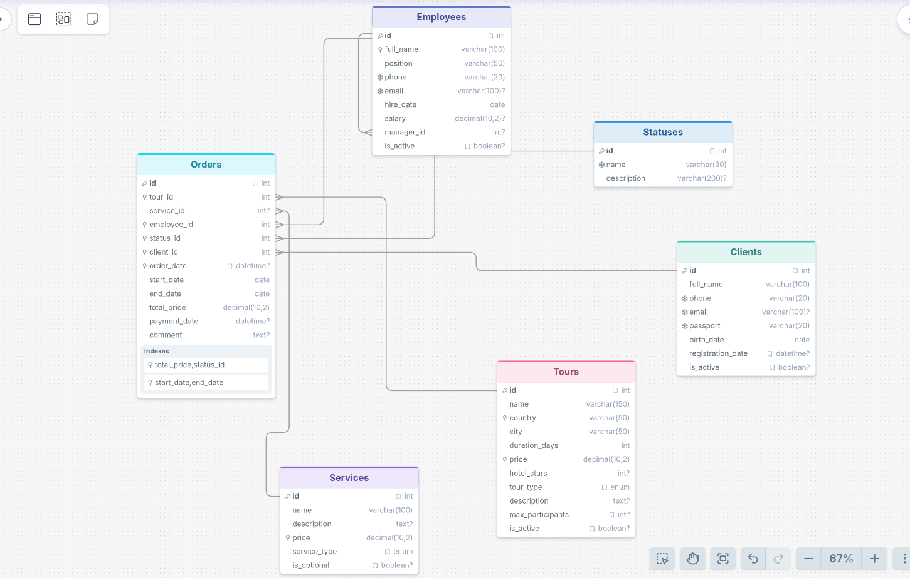

# Задача

Спроектируйте базу данных «Туризм» (перечень предоставляемых услуг, заказ туров и др.).
При проектировании базы данных необходимо создать 4-5 таблиц предметной области: 3-4 таблицы-справочника и 1 таблицу переменной информации. Для всех таблиц создать первичные ключи. Построить связи между таблицами при помощи внешних ключей: атрибуты таблицы переменной информации должны ссылаться на ключевые атрибуты таблиц справочников

## Решение

### База данных состоит из 6 таблиц: 4 справочника - редко меняющиеся данные, 2 переменные - данные, которые постоянно пополняются
#### Tours - Каталог туров: название, страна, город, длительность, цена, звёзды отеля, тип тура
#### Services - Каталог дополнительных услуг: трансфер, страховка, экскурсии, питание
#### Employees - Сотрудники турагентства: ФИО, должность, контакты, зарплата, руководитель
#### Statuses - Справочник статусов заказа: New, Confirmed, Paid, Completed, Cancelled
#### Clients - Клиенты турагентства: ФИО, телефон, email, паспорт, дата рождения
#### Orders - Заказы туров: связывает клиента, тур, услугу, сотрудника и статус
### Внешние ключи
#### В таблице Orders:
##### client_id -> Clients(id)
##### tour_id -> Tours(id)
##### service_id -> Services(id)
##### employee_id -> Employees(id)
##### status_id -> Statuses(id)
#### В таблице Employees:
##### manager_id -> Employees(id)

